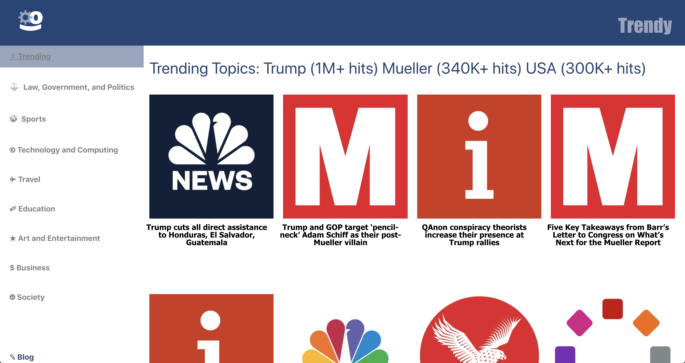
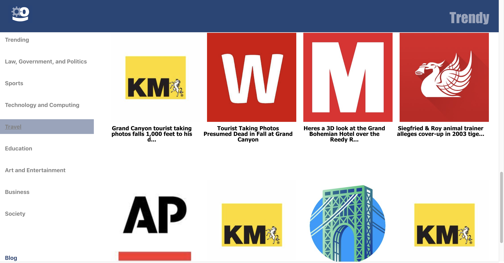

# Home Page

# Navigating Through a Category

## Inspiration
We are fascinated by how we get our news today. We remember watching the evening news on cable television as children; almost suddenly, the the world wide web has challenged news publishers to not only cover the next big thing, but to also lure their audience with attention-drawing topics and headliners.

**Trendy** was built to reflect the quick pace of modern day news. We find the most trending topics and instantly send users new articles to read with a simple click. 
## What it does
It retrieves the most popular topics and gathers articles related to those topics and provides a sleek interface for the user to constantly engage with many news articles without feeling overwhelmed.

## How we built it
We primarily used React to create the components of the website and both JavaScript and Python to extract trending topics, categories, and miscellaneous data by connecting to the Taboola API. From there it was a continuous improvement of how the data flowed throughout the system, fixing components, and adding new components to the website.

## Challenges we ran into
* It was all our first time learning React and there was constant frustration of props not being properly passed down to child components and states not properly being updated.

* Python dictionaries and JSONs were not always translatable since Python does not allow JSONs (dictionaries) as keys since they are not hashable.

* Occasionally the internet would be down so we could not call the Taboola API

* Components would frequently be misaligned. 

* Two of three of the teammates had to leave home early, leaving only one teammate to get as much down as possible.

## Accomplishments that we're proud of
We are pretty happy with how the website turned out. We did not think of a project until the morning after the hackathon started and are genuinely surprised with how far we got. We personally feel that the website has a smooth interface and there are some insights to be read from the articles that we bring to the user as well as the blog post we embedded that discusses some data analytics of the headlines of articles based in the U.S., U.K., and Australia.

## What we learned
* Most of the news articles in the world take a political stance.
* Most titles of the most trafficked articles evoke positive sentiment.
* Much of the world is currently interested in U.S. politics (e.g. Donald Trump, wall) and U.K. politics (e.g. Brexit, Theresa May)

## What's next for Trendy
The API has information of regions outside of the U.S. The next step for Trendy then is to support multiple regions.
